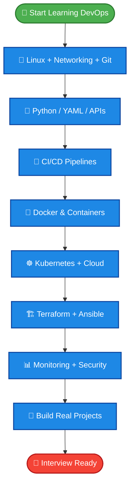
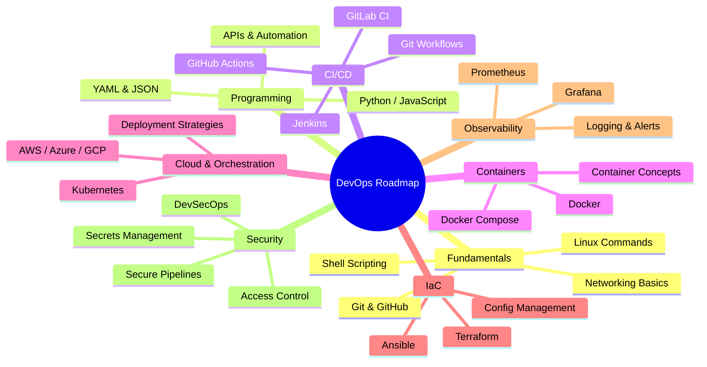
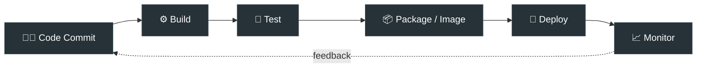
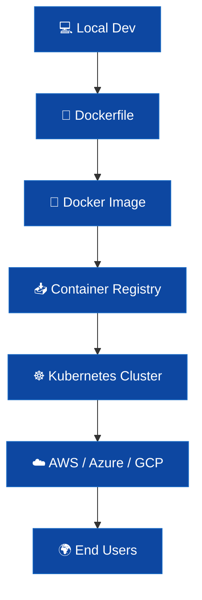

<div align="center">

# 🚀 DevOps Learning Roadmap

### A structured, visual path from fundamentals to production-ready DevOps skills


</div>

---

## 🌟 Goal

> Move from **basic concepts** to **practical, hands-on DevOps skills** — usable in real projects, technical interviews, and automation workflows.

---

## 🧭 The Full Journey — Visual Roadmap



---

## 🗺️ Stage-by-Stage Breakdown



---

## 📚 Roadmap Stages

<table>
<tr><th>#</th><th>Stage</th><th>Topics</th><th>Status</th></tr>

<tr>
<td>1️⃣</td>
<td><b>Fundamentals</b></td>
<td>Linux commands &bull; Shell scripting &bull; Networking basics &bull; Git &amp; GitHub &bull; CLI tools</td>
<td>⬜</td>
</tr>

<tr>
<td>2️⃣</td>
<td><b>Programming Basics</b></td>
<td>Python or JavaScript &bull; YAML &amp; JSON &bull; APIs &amp; automation basics</td>
<td>⬜</td>
</tr>

<tr>
<td>3️⃣</td>
<td><b>Git &amp; CI/CD</b></td>
<td>Git workflows &bull; Jenkins / GitHub Actions / GitLab CI &bull; Build &amp; deployment pipelines</td>
<td>⬜</td>
</tr>

<tr>
<td>4️⃣</td>
<td><b>Docker &amp; Containers</b></td>
<td>Docker &bull; Container concepts &bull; Docker Compose</td>
<td>⬜</td>
</tr>

<tr>
<td>5️⃣</td>
<td><b>Kubernetes &amp; Cloud</b></td>
<td>Kubernetes basics &bull; AWS / Azure / GCP &bull; Deployment strategies</td>
<td>⬜</td>
</tr>

<tr>
<td>6️⃣</td>
<td><b>Infrastructure as Code</b></td>
<td>Terraform &bull; Ansible &bull; Configuration management</td>
<td>⬜</td>
</tr>

<tr>
<td>7️⃣</td>
<td><b>Monitoring &amp; Observability</b></td>
<td>Prometheus &bull; Grafana &bull; Logging tools &bull; Metrics &amp; alerts</td>
<td>⬜</td>
</tr>

<tr>
<td>8️⃣</td>
<td><b>Security &amp; DevSecOps</b></td>
<td>Secrets management &bull; Secure pipelines &bull; Access control &bull; DevSecOps basics</td>
<td>⬜</td>
</tr>

<tr>
<td>9️⃣</td>
<td><b>Real Projects</b></td>
<td>CI/CD pipelines &bull; Containerized apps &bull; Kubernetes deployments &bull; Automated infra</td>
<td>⬜</td>
</tr>

</table>

> 💡 Tip: Replace ⬜ with ✅ as you complete each stage — a simple visual progress tracker right in your README.

---

## 🔧 CI/CD Pipeline Flow (Example)



---

## 🐳 Container-to-Cloud Flow (Example)



---

## 📁 Recommended Repository Structure

```text
DevOps/
├── README.md
├── notes/          # Personal learning notes per stage
├── pdfs/            # Study material (PDFs)
├── ppts/            # Presentation slides
└── projects/        # Hands-on mini projects & labs
```

---

## 🛠️ How to Use This Repo

| Folder | Purpose |
|---|---|
| `notes/` | Add your learning notes, organized by stage |
| `pdfs/` | Upload PDF study material |
| `ppts/` | Upload presentation files |
| `projects/` | Add mini projects, labs, and practice exercises |

---

## ✨ Future Updates

As you progress, link your own material here:

- 📄 [PDF Study Material](#)
- 📊 [Presentation Slides](#)
- 📝 [Hands-on Lab Notes](#)
- 🎬 [Project Demos](#)

---

<div align="center">

### ⭐ Track your journey, stage by stage — from `Fundamentals` to `Interview Ready`

**Happy Learning! 🚀**

</div>